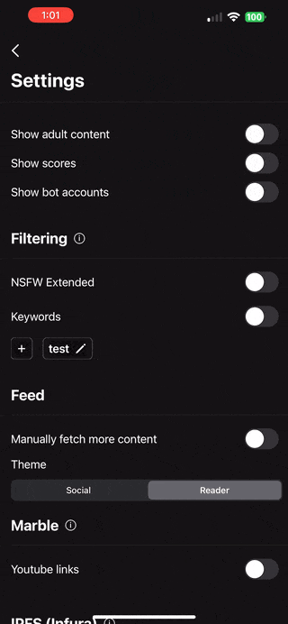

<p align="center"></p>

<h1 align="center">Loom (iOS & macOS) Beta</h1>

<p align="center"><a href="https://testflight.apple.com/join/owwIagmV">Testflight</a></p>

<p align="center"></p>

<p align="center">Aggregating aggregation. Providing everyone with a premium experience when interacting with federated servers. Meanwhile, providing view libraries and solutions for others to implement their own interpretations in the Apple ecosystem.</p>

## WARNING

- If Loom requests for "Local Network Access" it is because a neighboring server is using a localhost equivalent address. It is not because of the application itself. So please DO NOT ALLOW ACCESS. (unless you are expecting it).

## Requirements


[](https://opensource.org/license/mit/)

> My local environment: Xcode 14.2 or later // macOS (Intel) 12.6 or later // iOS 15.4 or later

## Disclaimers
- Due to the nature of possible state schemas being changed. Saved data such as account information or bookmarks may be removed in future release versions (or not at all).
- Keychain access warning. Keychain is only used for STORING your passwords and nothing else.

## Features
- Translated into 28 languages (MTL)
- Bookmarks are locally stored for offline viewing
- IPFS Content generation (Add your own config, gateway, etc)
- Login, Create Posts, Comments, Interact, update profiles as normal

| Expanded Layout (iPad/macOS)   | |
| :-------- | -------: |
|  | [Granite](https://github.com/pexavc/Granite) supports macOS. Same navigation API can direct window spawning or navigation stack pushing. |
|  | Spawn multiple windows of entire feed layouts with multiple communities to observe. Will be helpful in the case of moderating multiple communities for instance. |

| Looms    | |
| :-------- | -------: |
|  | Create "Looms" of any group of communities from any instance. Merging their content into a singular feed.|

| Explore    | |
| :-------- | -------: |
|   | Visit linked instances when connected to a lemmy server. View small snippets of each and their ping response time.   |

| Aggregation Sources (Aside from Lemmy)    | |
| :-------- | -------: |
|   | RSS feeds can be pulled when setting the instance URL to a valid endpoint. Pagination is not currently supported, but will be in the future. Looking at supporting Atom/JSON streams as well.   |
|   | Mastodon feeds can be pulled when setting the instance URL to a valid mastodon instance. Pagination is not currently supported, but will be in the future. Interactions are disabled for the time being `2023-9-4`.   |

| Safety    | |
| :-------- | -------: |
|   | On-device CoreML models + keyword filtering to remove posts from the feed. `NSFW Extended` will remove posts that are detected as NSFW even if they are not flagged as so.     |

| Styling    | |
| :-------- | -------: |
|   |  Intended to allow full user customization in the future. Currently supports a "social app feel" and a "reddit-like reader".   |

| MD helper  | |
| :-------- | -------: |
|  | Keyboard toolbar provides easy to access shortcuts on iPhone/iPad to help with Markdown formatting. |

| Travelling Modals    | |
| :-------- | -------: |
|   | Writing modals can travel with your viewing context. Allowing you to browse content in any stack prior to publishing.   |

| Bookmark Syncing    | |
| :-------- | -------: |
|   | All your saved posts and comments can be switched between accounts in a dedicated component.   |

| Sharing    | |
| :-------- | -------: |
|  | Share posts or comments as images. With the intention of supporting QR codes and *Engravings* in the future. |

| Search    | |
| :-------- | -------: |
|  | Either search all, a specific subcategory with sort support. View expanded contents within the view, interacting with content as normal. |

| Profile    | |
| :-------- | -------: |
|  | Dynamic threads, despite viewing context. Swipe to reply to comments or tap the more button, to modify, remove, block, etc.  |
|  | Deleting and restoring with toast reactions. |
|  | Switch accounts, view their profiles, and their scores. |

| Embedded Webview    | |
| :-------- | -------: |
|  | Custom JS insertion supported, customizing how webpages are viewed via direct user input is a possibility. |

| Light Mode    | |
| :-------- | -------: |
|  | Light mode and Dark mode supported. Refer to the color group in `Assets` to define your own preferences for each. |


## Contributing

Loom uses [Granite](https://github.com/pexavc/Granite) as a backing for components and services. The Components folder in this repo serves as a good example for many future components that may be needed. Any suggestions on Granite or other component layouts as a whole is greatly appreciated. Always feel free to open a PR and/or Issue.

An interactive websites to generate boilerplate components using a GUI to define styling and needed state properties is in the works! This will allow you to simply download the generated component and drag into XCode for immediate use.

### Why Granite?

Mostly because of *Relays* and project organization. I'd say testing too, but once I get around towards writing the unit tests, I'd feel more confident in sharing the strengths then. These work like @Observables/@AppStorage, but are more flexible in initializations and caching data. The ability to simply declare relays in any `View` or `GraniteComponent` allows for a more effective iterative process and cleaner context passing throughout the application.

```swift
@Relay var configService: ConfigService
```

## Swift Packages

- [Granite](https://github.com/pexavc/Granite)
- [MarqueKit](https://github.com/pexavc/marquekit)
- [MarbleKit](https://github.com/pexavc/marblekit)
- [ModerationKit](https://github.com/pexavc/moderationkit)
- [FederationKit](https://github.com/neatia/federationkit)
- [IPFSKit](https://github.com/pexavc/ipfskit)
- [NukeUI](https://github.com/kean/nuke) Thanks to [@kean](https://github.com/kean)
- [MarkdownView](https://github.com/pexavc/MarkdownView) Thanks to [@LiYanan2004](https://github.com/LiYanan2004)
- [KeyboardToolbar](https://github.com/simonbs/KeyboardToolbar) Thanks to [@simonbs](https://github.com/simonbs)

### Contact

- [Twitter @pexavc](https://twitter.com/pexavc)
